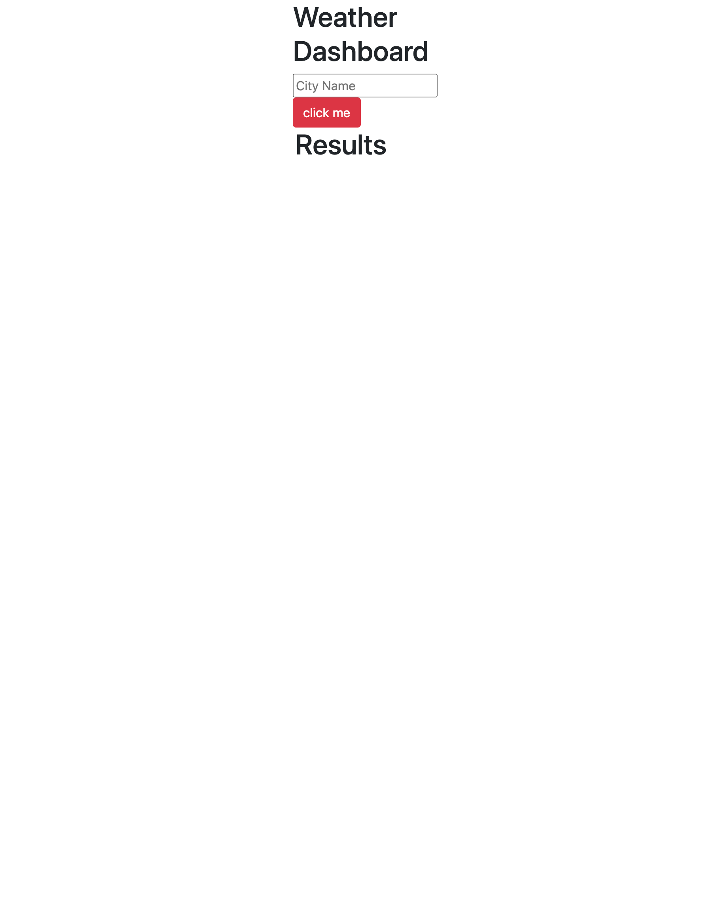

# Password-Generator

## Table Of Content

- [Description](#Description)
- [Visuals](#Visuals)
- [Usage](#Usage)
- [Links](#Links)

### Description

Built this project with JS, Jquery, and server side apis. This site is used to show my skills for api pulls. You input a location and it gives you the weather for that location.

### Visuals

### Usage

This site is used to check the weather for specific locations. It has an input field and a button to click to search. It will return your results and show the temperature for the day, the weather and 5 day forcast. It stores your previous searches and allows you to click them to recall the results.

### Links

[Repo] (https://github.com/FatherWolf/Weather-Dashboard)
[Password-Generator] (https://fatherwolf.github.io/Weather-Dashboard/)
